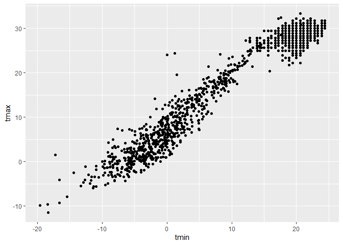
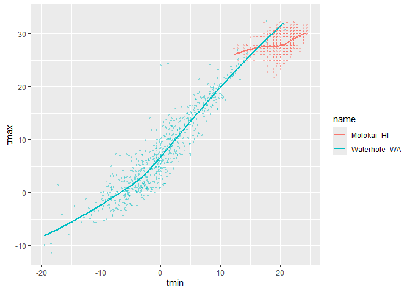
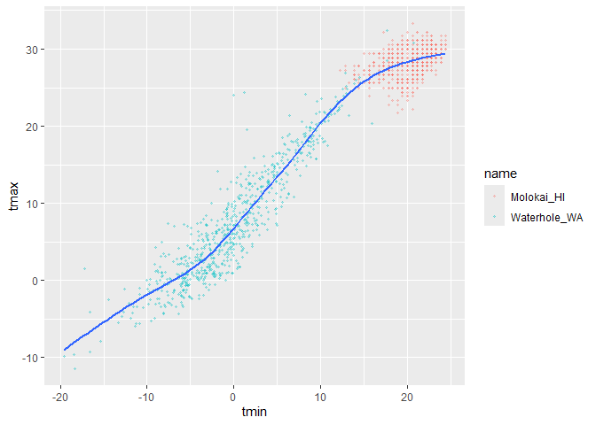

Vis_I
================

import the weather data:

``` r
weather_df = 
  rnoaa::meteo_pull_monitors(
    c("USW00094728", "USW00022534", "USS0023B17S"),
    var = c("PRCP", "TMIN", "TMAX"), 
    date_min = "2021-01-01",
    date_max = "2022-12-31") |>
  mutate(
    name = case_match(
      id, 
      "USW00094728" ~ "CentralPark_NY", 
      "USW00022534" ~ "Molokai_HI",
      "USS0023B17S" ~ "Waterhole_WA"),
    tmin = tmin / 10,
    tmax = tmax / 10) |>
  select(name, id, everything())
```

    ## using cached file: C:\Users\prade\AppData\Local/R/cache/R/rnoaa/noaa_ghcnd/USW00094728.dly

    ## date created (size, mb): 2024-09-26 10:19:50.159416 (8.668)

    ## file min/max dates: 1869-01-01 / 1923-05-31

    ## using cached file: C:\Users\prade\AppData\Local/R/cache/R/rnoaa/noaa_ghcnd/USW00022534.dly

    ## date created (size, mb): 2024-09-26 10:21:00.298876 (3.94)

    ## file min/max dates: 1949-10-01 / 2024-09-30

    ## using cached file: C:\Users\prade\AppData\Local/R/cache/R/rnoaa/noaa_ghcnd/USS0023B17S.dly

    ## date created (size, mb): 2024-09-26 10:21:27.528397 (1.038)

    ## file min/max dates: 1999-09-01 / 2024-09-30

Making our first plot :-)

``` r
ggplot(weather_df, aes(x=tmin, y=tmax)) +
  geom_point()
```

    ## Warning: Removed 17 rows containing missing values or values outside the scale range
    ## (`geom_point()`).

<!-- -->

another way:

``` r
weather_df |>
  ggplot(aes(x=tmin, y=tmax)) +
  geom_point()
```

    ## Warning: Removed 17 rows containing missing values or values outside the scale range
    ## (`geom_point()`).

<!-- -->

``` r
ggp_weather_scatterplot=
  weather_df |>
   ggplot(aes(x=tmin, y=tmax)) +
  geom_point()

ggp_weather_scatterplot
```

    ## Warning: Removed 17 rows containing missing values or values outside the scale range
    ## (`geom_point()`).

<!-- -->

check why some rows are missing.

Fancier scatterplots

``` r
weather_df |>
  ggplot(aes(x=tmin, y=tmax, color=name)) +
  geom_point(alpha = 0.3, size = 0.8)+
  geom_smooth(se= FALSE)
```

    ## `geom_smooth()` using method = 'loess' and formula = 'y ~ x'

    ## Warning: Removed 17 rows containing non-finite outside the scale range
    ## (`stat_smooth()`).

    ## Warning: Removed 17 rows containing missing values or values outside the scale range
    ## (`geom_point()`).

<!-- -->

``` r
# alpha makes the points a little more transparent, size is to make it smaller. Geom smooth gives you a smooth curve that fits through the data points.
```

where you define aesthetics can matter

``` r
weather_df |>
  ggplot(aes(x=tmin, y=tmax)) +
  geom_point(aes(color=name),alpha = 0.3, size = 0.8)+
  geom_smooth(se= FALSE)
```

    ## `geom_smooth()` using method = 'gam' and formula = 'y ~ s(x, bs = "cs")'

    ## Warning: Removed 17 rows containing non-finite outside the scale range
    ## (`stat_smooth()`).

    ## Warning: Removed 17 rows containing missing values or values outside the scale range
    ## (`geom_point()`).

<!-- -->

``` r
# moving the color statement to the next line, it will only show one smooth curve
```
