Vis_I
================

import the weather data:

``` r
weather_df = 
  rnoaa::meteo_pull_monitors(
    c("USW00094728", "USW00022534", "USS0023B17S"),
    var = c("PRCP", "TMIN", "TMAX"), 
    date_min = "2021-01-01",
    date_max = "2022-12-31") |>
  mutate(
    name = case_match(
      id, 
      "USW00094728" ~ "CentralPark_NY", 
      "USW00022534" ~ "Molokai_HI",
      "USS0023B17S" ~ "Waterhole_WA"),
    tmin = tmin / 10,
    tmax = tmax / 10) |>
  select(name, id, everything())
```

    ## using cached file: C:\Users\prade\AppData\Local/R/cache/R/rnoaa/noaa_ghcnd/USW00094728.dly

    ## date created (size, mb): 2024-09-26 10:19:50.159416 (8.668)

    ## file min/max dates: 1869-01-01 / 1923-05-31

    ## using cached file: C:\Users\prade\AppData\Local/R/cache/R/rnoaa/noaa_ghcnd/USW00022534.dly

    ## date created (size, mb): 2024-09-26 10:21:00.298876 (3.94)

    ## file min/max dates: 1949-10-01 / 2024-09-30

    ## using cached file: C:\Users\prade\AppData\Local/R/cache/R/rnoaa/noaa_ghcnd/USS0023B17S.dly

    ## date created (size, mb): 2024-09-26 10:21:27.528397 (1.038)

    ## file min/max dates: 1999-09-01 / 2024-09-30

Making our first plot :-)

``` r
ggplot(weather_df, aes(x=tmin, y=tmax)) +
  geom_point()
```

    ## Warning: Removed 17 rows containing missing values or values outside the scale range
    ## (`geom_point()`).

<!-- -->

another way:

``` r
weather_df |>
  ggplot(aes(x=tmin, y=tmax)) +
  geom_point()
```

    ## Warning: Removed 17 rows containing missing values or values outside the scale range
    ## (`geom_point()`).

<!-- -->

``` r
ggp_weather_scatterplot=
  weather_df |>
   ggplot(aes(x=tmin, y=tmax)) +
  geom_point()

ggp_weather_scatterplot
```

    ## Warning: Removed 17 rows containing missing values or values outside the scale range
    ## (`geom_point()`).

<!-- -->

check why some rows are missing.

# Fancier scatter plots:

``` r
weather_df |>
  ggplot(aes(x=tmin, y=tmax, color=name)) +
  geom_point(alpha = 0.3, size = 0.8)+
  geom_smooth(se= FALSE)
```

    ## `geom_smooth()` using method = 'loess' and formula = 'y ~ x'

    ## Warning: Removed 17 rows containing non-finite outside the scale range
    ## (`stat_smooth()`).

    ## Warning: Removed 17 rows containing missing values or values outside the scale range
    ## (`geom_point()`).

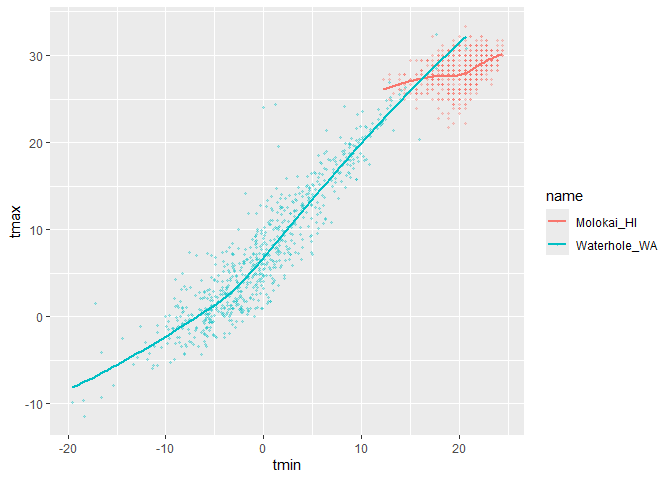<!-- -->

``` r
# alpha makes the points a little more transparent, size is to make it smaller. Geom smooth gives you a smooth curve that fits through the data points.
```

where you define aesthetics can matter:

``` r
weather_df |>
  ggplot(aes(x=tmin, y=tmax)) +
  geom_point(aes(color=name),alpha = 0.3, size = 0.8)+
  geom_smooth(se= FALSE)
```

    ## `geom_smooth()` using method = 'gam' and formula = 'y ~ s(x, bs = "cs")'

    ## Warning: Removed 17 rows containing non-finite outside the scale range
    ## (`stat_smooth()`).

    ## Warning: Removed 17 rows containing missing values or values outside the scale range
    ## (`geom_point()`).

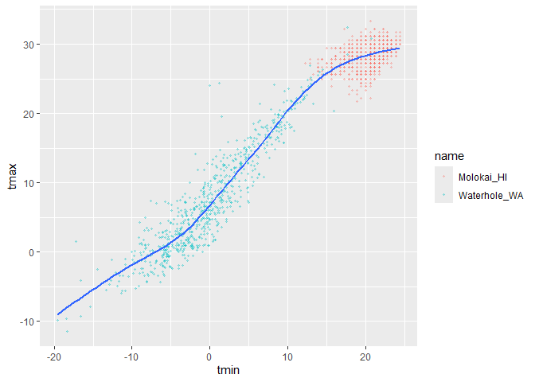<!-- -->

``` r
# moving the color statement to the next line, it will only show one smooth curve
```

``` r
weather_df |>
  ggplot(aes(x=tmin, y=tmax, color=name))+
  geom_point(alpha=0.3)+
  geom_smooth(se=FALSE)+
  facet_grid(. ~ name)
```

    ## `geom_smooth()` using method = 'loess' and formula = 'y ~ x'

    ## Warning: Removed 17 rows containing non-finite outside the scale range
    ## (`stat_smooth()`).

    ## Warning: Removed 17 rows containing missing values or values outside the scale range
    ## (`geom_point()`).

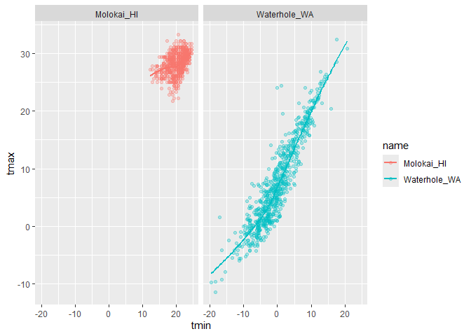<!-- -->

``` r
#facet grid, rows ~ column
```

lets make a somewhat more interesting scatterplot

``` r
weather_df |>
  ggplot(aes(x=date, y=tmax, color=name, size=prcp)) +
  geom_point(alpha=.3) +
  geom_smooth(se=FALSE) +
  facet_grid(. ~ name)
```

    ## Warning: Using `size` aesthetic for lines was deprecated in ggplot2 3.4.0.
    ## ℹ Please use `linewidth` instead.
    ## This warning is displayed once every 8 hours.
    ## Call `lifecycle::last_lifecycle_warnings()` to see where this warning was
    ## generated.

    ## `geom_smooth()` using method = 'loess' and formula = 'y ~ x'

    ## Warning: Removed 17 rows containing non-finite outside the scale range
    ## (`stat_smooth()`).

    ## Warning: The following aesthetics were dropped during statistical transformation: size.
    ## ℹ This can happen when ggplot fails to infer the correct grouping structure in
    ##   the data.
    ## ℹ Did you forget to specify a `group` aesthetic or to convert a numerical
    ##   variable into a factor?
    ## The following aesthetics were dropped during statistical transformation: size.
    ## ℹ This can happen when ggplot fails to infer the correct grouping structure in
    ##   the data.
    ## ℹ Did you forget to specify a `group` aesthetic or to convert a numerical
    ##   variable into a factor?

    ## Warning: Removed 19 rows containing missing values or values outside the scale range
    ## (`geom_point()`).

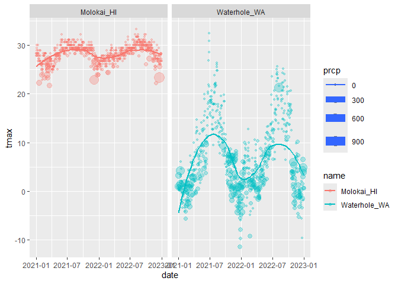<!-- -->

Learning assesment:

``` r
weather_df |> 
  filter(name == "CentralPark_NY") |> 
  mutate(
    tmax_fahr = tmax * (9 / 5) + 32,
    tmin_fahr = tmin * (9 / 5) + 32) |> 
  ggplot(aes(x = tmin_fahr, y = tmax_fahr)) +
  geom_point(alpha = .5) + 
  geom_smooth(method = "lm", se = FALSE)
```

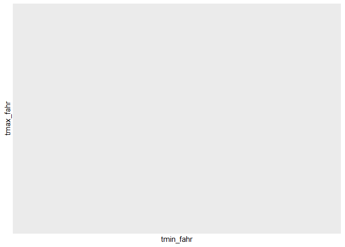<!-- -->

``` r
ggplot(weather_df, aes(x = date, y = tmax, color = name)) + 
  geom_smooth(se = FALSE) 
```

    ## `geom_smooth()` using method = 'loess' and formula = 'y ~ x'

    ## Warning: Removed 17 rows containing non-finite outside the scale range
    ## (`stat_smooth()`).

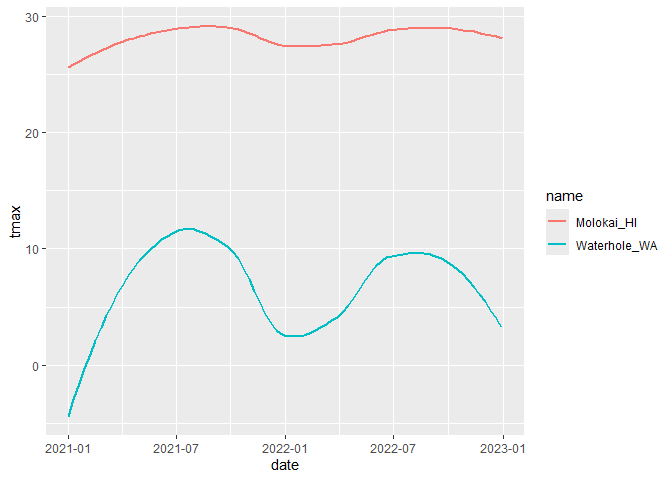<!-- -->

``` r
ggplot(weather_df, aes(x = tmax, y = tmin)) + 
  geom_hex()
```

    ## Warning: Removed 17 rows containing non-finite outside the scale range
    ## (`stat_binhex()`).

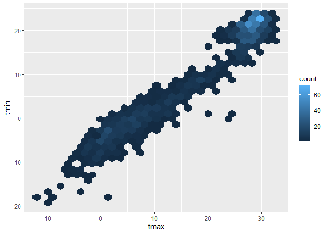<!-- -->

``` r
weather_df |>
  ggplot(aes(x = tmax, y = tmin))+
  geom_point(color = "blue")
```

    ## Warning: Removed 17 rows containing missing values or values outside the scale range
    ## (`geom_point()`).

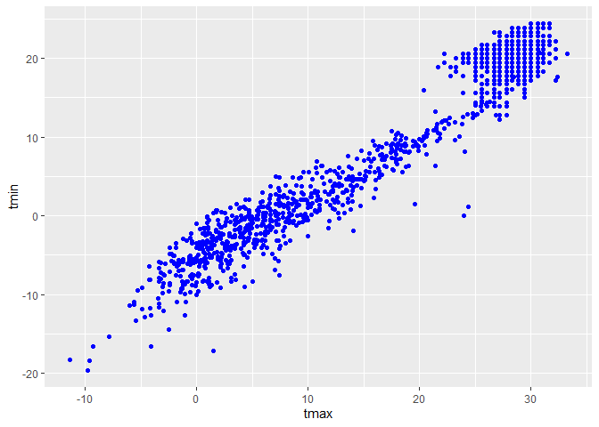<!-- -->

``` r
# the color needs to be in quotes. if its a variable or df then no need for quotes
```

histogram:

``` r
weather_df |>
  ggplot(aes(x=tmin))+
  geom_histogram()
```

    ## `stat_bin()` using `bins = 30`. Pick better value with `binwidth`.

    ## Warning: Removed 17 rows containing non-finite outside the scale range
    ## (`stat_bin()`).

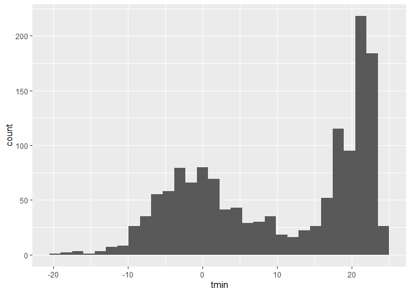<!-- -->

``` r
weather_df |>
  ggplot(aes(x=tmin, fill = name))+
  geom_histogram(postition = "dodge")
```

    ## Warning in geom_histogram(postition = "dodge"): Ignoring unknown parameters:
    ## `postition`

    ## `stat_bin()` using `bins = 30`. Pick better value with `binwidth`.

    ## Warning: Removed 17 rows containing non-finite outside the scale range
    ## (`stat_bin()`).

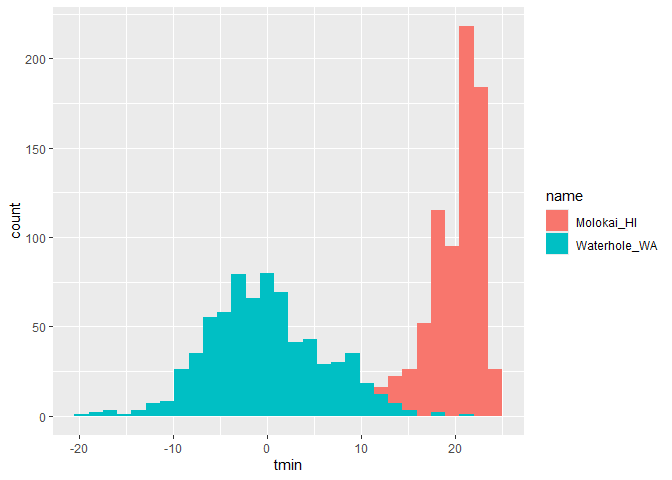<!-- -->

``` r
weather_df |>
  ggplot(aes(x=tmin, fill=name))+
  geom_histogram()+
  facet_grid(. ~ name)
```

    ## `stat_bin()` using `bins = 30`. Pick better value with `binwidth`.

    ## Warning: Removed 17 rows containing non-finite outside the scale range
    ## (`stat_bin()`).

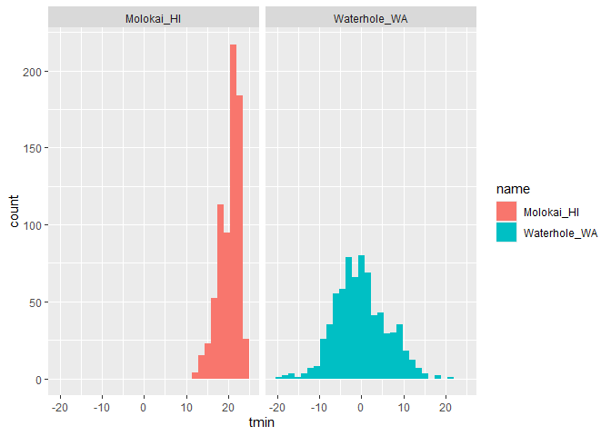<!-- -->

maybe a density plot?

``` r
weather_df |>
  ggplot(aes(x=tmin, fill=name))+
  geom_density(alpha=.3)
```

    ## Warning: Removed 17 rows containing non-finite outside the scale range
    ## (`stat_density()`).

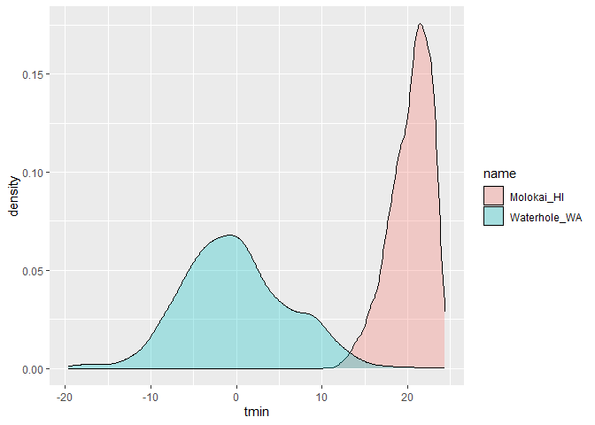<!-- -->

box plots:

``` r
weather_df |>
  ggplot(aes(x=name, y=tmin, fill = name))+
  geom_boxplot()
```

    ## Warning: Removed 17 rows containing non-finite outside the scale range
    ## (`stat_boxplot()`).

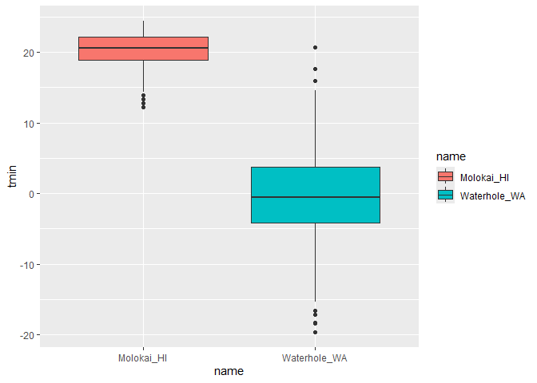<!-- -->

violin plots:

``` r
weather_df |>
  ggplot(aes(x=name, y=tmin, fill = name))+
  geom_violin()
```

    ## Warning: Removed 17 rows containing non-finite outside the scale range
    ## (`stat_ydensity()`).

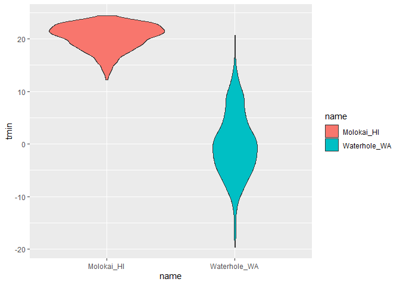<!-- -->

``` r
weather_df |>
  ggplot(aes(x=tmin, y=name))+
  geom_density_ridges()
```

    ## Picking joint bandwidth of 1.01

    ## Warning: Removed 17 rows containing non-finite outside the scale range
    ## (`stat_density_ridges()`).

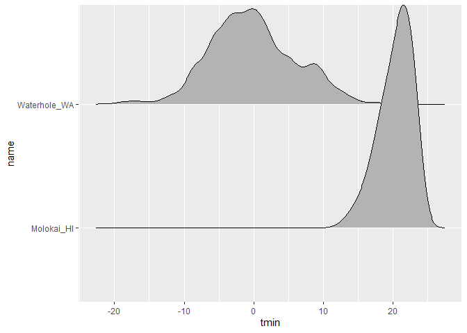<!-- -->

LA univariates plots

``` r
ggplot(weather_df, aes(x = prcp)) +   geom_density(aes(fill = name), alpha = .5) 
```

    ## Warning: Removed 15 rows containing non-finite outside the scale range
    ## (`stat_density()`).

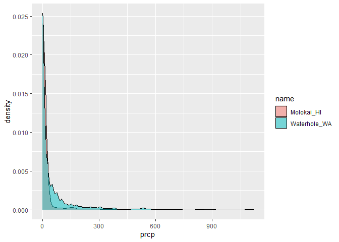<!-- -->
