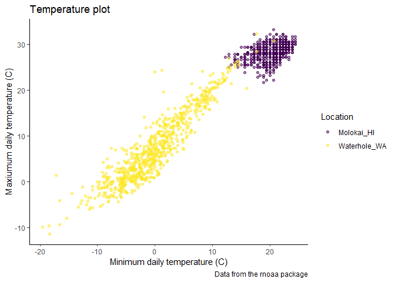

Vis_II
================

``` r
weather_df = 
  rnoaa::meteo_pull_monitors(
    c("USW00094728", "USW00022534", "USS0023B17S"),
    var = c("PRCP", "TMIN", "TMAX"), 
    date_min = "2021-01-01",
    date_max = "2022-12-31") |>
  mutate(
    name = case_match(
      id, 
      "USW00094728" ~ "CentralPark_NY", 
      "USW00022534" ~ "Molokai_HI",
      "USS0023B17S" ~ "Waterhole_WA"),
    tmin = tmin / 10,
    tmax = tmax / 10) |>
  select(name, id, everything())
```

    ## using cached file: C:\Users\prade\AppData\Local/R/cache/R/rnoaa/noaa_ghcnd/USW00094728.dly

    ## date created (size, mb): 2024-09-26 10:19:50.159416 (8.668)

    ## file min/max dates: 1869-01-01 / 1923-05-31

    ## using cached file: C:\Users\prade\AppData\Local/R/cache/R/rnoaa/noaa_ghcnd/USW00022534.dly

    ## date created (size, mb): 2024-09-26 10:21:00.298876 (3.94)

    ## file min/max dates: 1949-10-01 / 2024-09-30

    ## using cached file: C:\Users\prade\AppData\Local/R/cache/R/rnoaa/noaa_ghcnd/USS0023B17S.dly

    ## date created (size, mb): 2024-09-26 10:21:27.528397 (1.038)

    ## file min/max dates: 1999-09-01 / 2024-09-30

``` r
weather_df |>
  ggplot(aes(x = tmin, y = tmax, color = name)) +
  geom_point(alpha = 0.3) +
  labs(
    title = "Temperature scatterplot", 
    x = "Minimum Temp (C)", 
    y = "Maximum Temp (C)",
    color = "Location",
    caption = "Weather data taken from rnoaa package for three stations"
  ) +
  scale_x_continuous(
    breaks = c(-15, 0, 20),
    labels = c("-15º C", "0", "15"), 
limits = c(-20, 30)) + 
  scale_y_continuous(
    trans = "sqrt", 
    position = "right")
```

    ## Warning in transformation$transform(x): NaNs produced

    ## Warning in scale_y_continuous(trans = "sqrt", position = "right"): sqrt
    ## transformation introduced infinite values.

    ## Warning: Removed 120 rows containing missing values or values outside the scale range
    ## (`geom_point()`).

<!-- -->

Looking at colors:

``` r
weather_df |> 
  ggplot(aes(x = tmin, y = tmax)) + 
  geom_point(aes(color = name), alpha = .5) + 
  labs(
    title = "Temperature plot",
    x = "Minimum daily temperature (C)",
    y = "Maxiumum daily temperature (C)",
    color = "Location",
    caption = "Data from the rnoaa package") + 
  scale_color_hue(h = c(100, 300)) 
```

    ## Warning: Removed 17 rows containing missing values or values outside the scale range
    ## (`geom_point()`).

<!-- -->

### I would look at color pallets that are already made. Maybe use the virdis color pallet.

``` r
ggp_temp_plot = 
  weather_df |> 
  ggplot(aes(x = tmin, y = tmax)) + 
  geom_point(aes(color = name), alpha = .5) + 
  labs(
    title = "Temperature plot",
    x = "Minimum daily temperature (C)",
    y = "Maxiumum daily temperature (C)",
    color = "Location",
    caption = "Data from the rnoaa package"
  ) + 
  viridis::scale_color_viridis(
    name = "Location", 
    discrete = TRUE
  )
```

## Themes

``` r
ggp_scatterplot = 
  weather_df |> 
  ggplot(aes(x = tmin, y = tmax)) + 
  geom_point(aes(color = name), alpha = .5) + 
  labs(
    title = "Temperature plot",
    x = "Minimum daily temperature (C)",
    y = "Maxiumum daily temperature (C)",
    color = "Location",
    caption = "Data from the rnoaa package") + 
  viridis::scale_color_viridis(discrete = TRUE)
```

``` r
ggp_scatterplot +
  theme(legend.position = "bottom")
```

    ## Warning: Removed 17 rows containing missing values or values outside the scale range
    ## (`geom_point()`).

<!-- -->

``` r
# moving legend position
```

``` r
ggp_scatterplot +
  theme_bw() +
  # background is black and white
  theme(legend.position = "bottom")
```

    ## Warning: Removed 17 rows containing missing values or values outside the scale range
    ## (`geom_point()`).

<!-- -->

Order matters…

``` r
ggp_scatterplot +
  theme(legend.position = "bottom") +
  theme_bw()
```

    ## Warning: Removed 17 rows containing missing values or values outside the scale range
    ## (`geom_point()`).

<!-- -->

using theme bw puts everything back; resets; so be aware of order.

``` r
ggp_scatterplot +
  theme(legend.position = "bottom") +
  theme_minimal()
```

    ## Warning: Removed 17 rows containing missing values or values outside the scale range
    ## (`geom_point()`).

<!-- -->

``` r
ggp_scatterplot +
  theme(legend.position = "bottom") +
  theme_classic()
```

    ## Warning: Removed 17 rows containing missing values or values outside the scale range
    ## (`geom_point()`).

<!-- -->

``` r
ggp_scatterplot +
  theme(legend.position = "bottom") +
  ggthemes::theme_excel()
```

    ## Warning: Removed 17 rows containing missing values or values outside the scale range
    ## (`geom_point()`).

<!-- -->

Learning assesment New Scatterplot

``` r
weather_df |>
  ggplot(aes(x = date, y = tmax, color = name, size = prcp)) +
  geom_point(alpha = .3) +
  geom_smooth(se=FALSE) +
  viridis::scale_color_viridis(discrete = TRUE) +
  labs(
    title = "Seasonal Variation in Max Temp",
    x = "Date",
    y = "Maxiumum temperature (C)",
    size = "Percipitation"
  ) + 
  theme_minimal() + 
  theme(legend.position = "bottom")
```

    ## Warning: Using `size` aesthetic for lines was deprecated in ggplot2 3.4.0.
    ## ℹ Please use `linewidth` instead.
    ## This warning is displayed once every 8 hours.
    ## Call `lifecycle::last_lifecycle_warnings()` to see where this warning was
    ## generated.

    ## `geom_smooth()` using method = 'loess' and formula = 'y ~ x'

    ## Warning: Removed 17 rows containing non-finite outside the scale range
    ## (`stat_smooth()`).

    ## Warning: The following aesthetics were dropped during statistical transformation: size.
    ## ℹ This can happen when ggplot fails to infer the correct grouping structure in
    ##   the data.
    ## ℹ Did you forget to specify a `group` aesthetic or to convert a numerical
    ##   variable into a factor?

    ## Warning: Removed 19 rows containing missing values or values outside the scale range
    ## (`geom_point()`).

<!-- -->

Extra bonus stuff in `ggplot`

USe different data sets in different `geom`s

``` r
central_park_df =
  weather_df |>
  filter(name == "CentralPark_NY")

molokai_df =
weather_df |>
  filter(name == "Molokai_HI")

molokai_df |>
  ggplot(aes(x = date, y = tmax, color = name)) +
  geom_point() +
  geom_line(data = central_park_df)
```

    ## Warning: Removed 1 row containing missing values or values outside the scale range
    ## (`geom_point()`).

<!-- -->

## Multiple panels

``` r
weather_df |>
  ggplot(aes(x = tmax, fill=name)) +
  geom_density() +
  facet_grid(. ~ name)
```

    ## Warning: Removed 17 rows containing non-finite outside the scale range
    ## (`stat_density()`).

<!-- -->

run patch work library before this:

``` r
ggp_tmax_tmin = 
  weather_df |>
  ggplot(aes(x=tmin, y=tmax, color=name)) +
  geom_point(alpha=.3)

ggp_tmax_density =
  weather_df |>
  ggplot(aes(x=tmax, fill= name)) +
  geom_density(alpla=.3)
```

    ## Warning in geom_density(alpla = 0.3): Ignoring unknown parameters: `alpla`

``` r
ggp_tmax_date =
  weather_df |>
  ggplot(aes(x=date, y=tmax, color=name)) +
  geom_point() +
  geom_smooth(se=FALSE)

(ggp_tmax_tmin + ggp_tmax_density)/ ggp_tmax_date
```

    ## Warning: Removed 17 rows containing missing values or values outside the scale range
    ## (`geom_point()`).

    ## Warning: Removed 17 rows containing non-finite outside the scale range
    ## (`stat_density()`).

    ## `geom_smooth()` using method = 'loess' and formula = 'y ~ x'

    ## Warning: Removed 17 rows containing non-finite outside the scale range
    ## (`stat_smooth()`).

    ## Warning: Removed 17 rows containing missing values or values outside the scale range
    ## (`geom_point()`).

<!-- -->

## Data manipulation

``` r
weather_df |>
  mutate(name=fct_relevel(name, c("Molokai_HI", "CentralPark_NY", "Waterhole_WA"))) |>
  ggplot(aes(x=name, y=tmax, fill=name)) +
  geom_violin(alpha=.5)
```

    ## Warning: There was 1 warning in `mutate()`.
    ## ℹ In argument: `name = fct_relevel(name, c("Molokai_HI", "CentralPark_NY",
    ##   "Waterhole_WA"))`.
    ## Caused by warning:
    ## ! 1 unknown level in `f`: CentralPark_NY

    ## Warning: Removed 17 rows containing non-finite outside the scale range
    ## (`stat_ydensity()`).

<!-- -->

Pulse data next:

``` r
pulse_df=
  read_sas("data/public_pulse_data.sas7bdat") |>
  janitor::clean_names() |>
  # have to create variables before making the plot.
  pivot_longer(
    cols = bdi_score_bl:bdi_score_12m,
    names_to= "visit",
    values_to= "bdi_score",
    names_prefix = "bdi_score_"
  ) |>
  mutate(visit = ifelse(visit == "bl", "00m", visit))
# whats happening in parenthesis: take bl replace w 00m and otherwise leave alone. the box plots will now be in order of time (before numbers came before letters)

pulse_df |>
  ggplot(aes(x=visit, y=bdi_score)) +
  geom_boxplot()
```

    ## Warning: Removed 879 rows containing non-finite outside the scale range
    ## (`stat_boxplot()`).

<!-- -->
