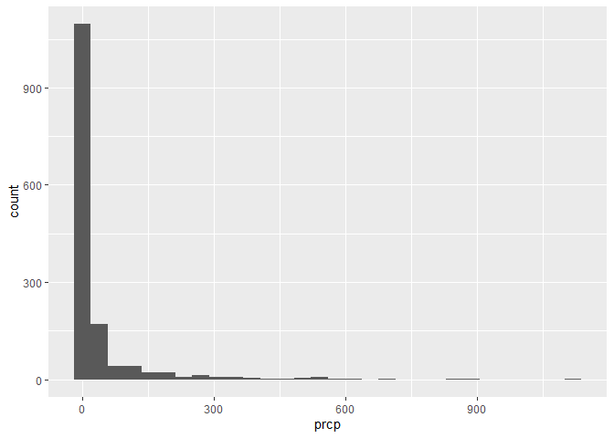

EDA
================

``` r
weather_df = 
  rnoaa::meteo_pull_monitors(
    c("USW00094728", "USW00022534", "USS0023B17S"),
    var = c("PRCP", "TMIN", "TMAX"), 
    date_min = "2021-01-01",
    date_max = "2022-12-31") |>
  mutate(
    name = case_match(
      id, 
      "USW00094728" ~ "CentralPark_NY", 
      "USW00022534" ~ "Molokai_HI",
      "USS0023B17S" ~ "Waterhole_WA"),
    tmin = tmin / 10,
    tmax = tmax / 10,
    month = floor_date(date, unit = "month"))|>
  select(name, id, everything())
```

    ## using cached file: C:\Users\prade\AppData\Local/R/cache/R/rnoaa/noaa_ghcnd/USW00094728.dly

    ## date created (size, mb): 2024-09-26 10:19:50.159416 (8.668)

    ## file min/max dates: 1869-01-01 / 1923-05-31

    ## using cached file: C:\Users\prade\AppData\Local/R/cache/R/rnoaa/noaa_ghcnd/USW00022534.dly

    ## date created (size, mb): 2024-09-26 10:21:00.298876 (3.94)

    ## file min/max dates: 1949-10-01 / 2024-09-30

    ## using cached file: C:\Users\prade\AppData\Local/R/cache/R/rnoaa/noaa_ghcnd/USS0023B17S.dly

    ## date created (size, mb): 2024-09-26 10:21:27.528397 (1.038)

    ## file min/max dates: 1999-09-01 / 2024-09-30

Lets make some plots:

``` r
weather_df |>
  ggplot(aes(x=prcp)) +
  geom_histogram()
```

    ## `stat_bin()` using `bins = 30`. Pick better value with `binwidth`.

    ## Warning: Removed 15 rows containing non-finite outside the scale range
    ## (`stat_bin()`).

<!-- -->

``` r
weather_df |>
  filter(prcp > 1000)
```

    ## # A tibble: 1 × 7
    ##   name       id          date        prcp  tmax  tmin month     
    ##   <chr>      <chr>       <date>     <dbl> <dbl> <dbl> <date>    
    ## 1 Molokai_HI USW00022534 2022-12-18  1120  23.3  18.9 2022-12-01
